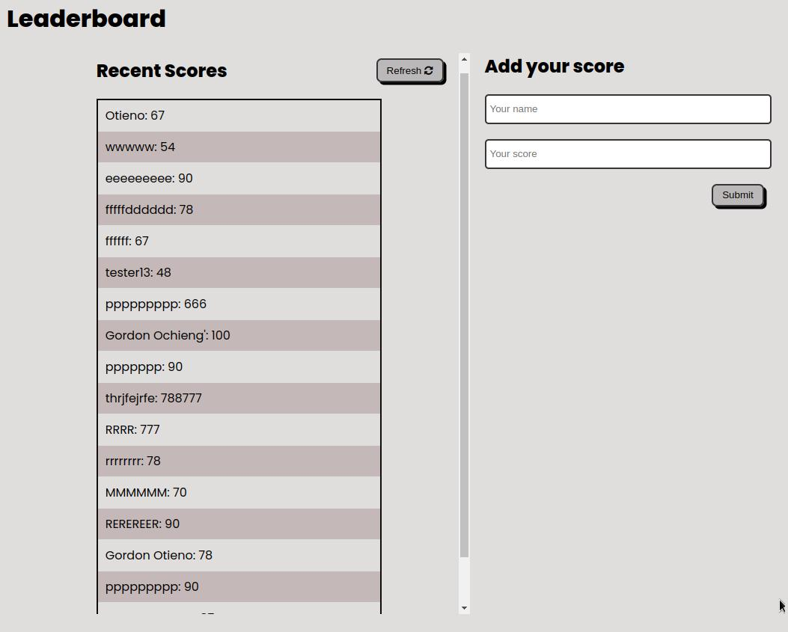

# Leaderboard
> The leaderboard website displays scores submitted by different players. It also allows you to submit your score. 

# Screenshort

## Built With

 - html
 - css
 - javascript
 - **Frameworks** :webpack

## Live Demo

[leaderboad](https://gordonotieno.github.io/leaderboard/)

## Getting Started
 In order to use the files, you will need to clone it and then follow the instructions below: 
 
## Prerequisites
- Good Knowlege of html and css.
- Some knowledge of javascript.
- Install nodejs then copy linters files from https://github.com/microverseinc/linters-config/tree/master/html-css-js

### Setup
Use 'git clone https://github.com/GordonOtieno/leaderboard.git' to clone the repository to your local environment and begin working on it.

## Authors

👤 **Gordon Otieno**

- GitHub: [@GordonOtieno](https://github.com/GordonOtieno)
- Twitter: [@GordonO34459259](https://twitter.com/@GordonO34459259)

## 🤝 Contributing

Contributions, issues, and feature requests are welcome!

Feel free to check the [issues page](https://github.com/GordonOtieno/leaderboard/issues).

## Acknowledgements.
[Leaderboard API Service](https://us-central1-js-capstone-backend.cloudfunctions.net/api/) developer of the API used.

## Show your support

Give a ⭐️ if you like this project!

## 📝 License

This project is [MIT](./MIT.md) licensed.

